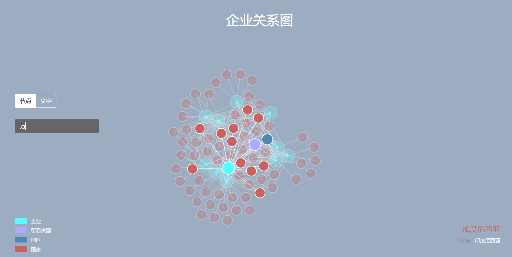
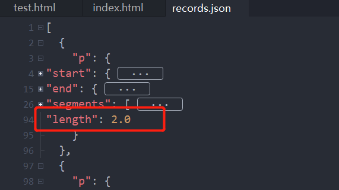
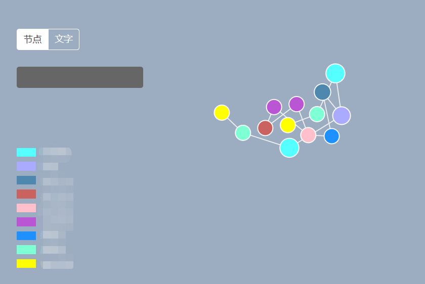

# 根据Neo4j导出的JSON数据做D3可视化展示

启动服务，再打开 `index.html` 查看效果

效果图如下及说明：

- 在搜索、鼠标进入该节点时会展示临近的关系节点
- 点击节点、文字切换显示
- 加入了碰撞检测模型，已注释，取消即可与效果图相同



效果展示：
[https://coderwanp.github.io/neo4j-d3-graph/](https://coderwanp.github.io/neo4j-d3-graph/)

# 代码使用说明

## 关于启动服务

由于知识图谱的JSON文件加载是通过AJAX请求过来，所以直接打开html文件会报**跨域错误**。

正确的启动方法是通过IDE软件以项目形式打开文件夹，比如：HBuildX、PyCharm、VSCode、IDEA等，很多启动都自带服务，此时通过 `localhost:端口号` 访问 `index.html` 即可查看效果。

## JSON格式要求

以 **p** 为键值对表示，每个 **p** 为一个查询关系。

按如下Cypher查询语句导出均可以展示：

```cypher
MATCH p=(n:节点类型)-[r:关系类型]->() RETURN p limit 20
```

## 如何配置为自己的数据

在 `<script>` 标签中定位，修改如下几行代码即可，不需要在到处去找位置了

```js
// 自定义图标及颜色（数组保证一一对应）
// names		图例名称变量制作图标
// labels		节点的标签名称（与records.json中保证相同）
// colors		图例颜色
// url 			json文件的路径
var names = ['企业', '贸易类型', '地区', '国家']
var labels = ['Enterprise', 'Type', 'Region', 'Country']
var colors = ['#55ffff', '#aaaaff', '#4e88af', '#ca635f']
var url = 'data/records.json'
```

# 修改说明

## 2021.04.01

之前的代码只支持 **距离为1** 的关系路径导入。

如果你从Neo4j导出的 `records.json` 中关系路径长度大于1，如下图这种情况会导致节点全部移至左上角。**现在已经修改完毕，支持长距离路径的图，只要满足JSON格式要求，即可进行可视化展示。**



## 2021.04.05

修复图例颜色问题，之前图例超过4个就无法填充颜色了，现在已更改

多图例情况：（热心网友提供的数据，所以打个码）



## 2021.06.30

关于力导向拖拽的代码，确实文档没有说明清楚，在 `vue-d3-graph` 的项目是拖拽后固定不动，这个项目现改为拖拽后回弹，如果想要固定的效果注释 `dragended` 的代码即可。

```js
// 拖动函数代码
var dragging = false;
// 开始拖动并更新相应的点
function dragstarted(d) {
    if (!d3.event.active) simulation.alphaTarget(0.3).restart();
    d.fx = d.x;
    d.fy = d.y;
    dragging = true;
}
// 拖动进行中
function dragged(d) {
    d.fx = d3.event.x;
    d.fy = d3.event.y;
}
// 拖动结束
function dragended(d) {
    if (!d3.event.active) simulation.alphaTarget(0);
    // 注释以下两行，拖拽后节点固定不动
    // d.fx = null;
    // d.fy = null;
    dragging = false;
}
```

